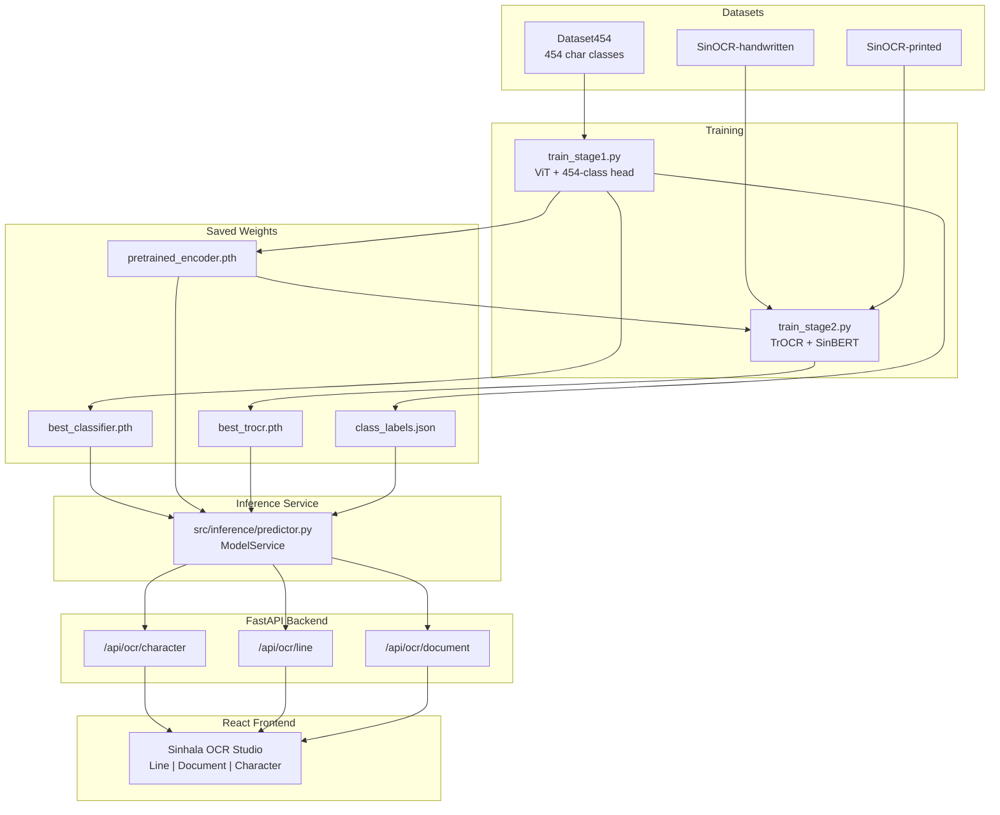

# Sinhala OCR Studio — Complete Project Guide (A to Z)

> **What is this project?**  
> A full **Sinhala Optical Character Recognition (OCR)** system that reads Sinhala text from images. It uses a **two-stage deep learning pipeline**: first learn what individual characters look like, then learn to read whole lines and documents. A production **web app** (React + FastAPI) lets anyone upload images and get Sinhala text back.

This README is written like a **teacher’s guide** — start at the top if you are new, or jump to any section you need.

---

## Table of Contents

1. [The Big Picture](#1-the-big-picture)
2. [Why Two Stages?](#2-why-two-stages)
3. [System Architecture](#3-system-architecture)
4. [Project Folder Structure](#4-project-folder-structure)
5. [Datasets (What the Models Learn From)](#5-datasets-what-the-models-learn-from)
6. [Stage 1 — Character Classifier](#6-stage-1--character-classifier)
7. [Stage 2 — Line OCR (TrOCR)](#7-stage-2--line-ocr-trocr)
8. [Training Results (Your Run)](#8-training-results-your-run)
9. [Document Preprocessing Pipeline](#9-document-preprocessing-pipeline)
10. [Web Application](#10-web-application)
11. [API Reference](#11-api-reference)
12. [Environment Setup (Step by Step)](#12-environment-setup-step-by-step)
13. [How to Train the Models](#13-how-to-train-the-models)
14. [How to Run the Web App](#14-how-to-run-the-web-app)
15. [PowerShell Tips (Windows)](#15-powershell-tips-windows)
16. [Key Files Explained](#16-key-files-explained)
17. [Design Decisions & Problems Solved](#17-design-decisions--problems-solved)
18. [Docker Deployment](#18-docker-deployment)
19. [How to Extend This Project](#19-how-to-extend-this-project)
20. [Glossary](#20-glossary)
21. [References & Credits](#21-references--credits)

---

## 1. The Big Picture

**OCR** = take an image of text → output digital text.

Sinhala is a complex script (letters + vowel signs + ligatures). This project solves OCR in layers:

| Layer | What it does | Analogy |
|-------|----------------|---------|
| **Stage 1** | Recognizes **one character** at a time (454 classes) | Learning the Sinhala alphabet |
| **Stage 2** | Reads **full lines** of handwritten/printed Sinhala | Reading words and sentences |
| **Preprocessing** | Splits a **document page** into lines | Cutting a page into rows before reading |
| **Web App** | Upload image → get text in the browser | The user-facing product |

**End-to-end flow for a document:**

```
User uploads page image
        ↓
OpenCV preprocessing (deskew, binarize, find lines)
        ↓
Each line image → Stage 2 TrOCR → Sinhala text per line
        ↓
Join lines → full document text shown in UI
```

---

## 2. Why Two Stages?

### Stage 1 teaches the “eyes”
- Dataset454 has **454 Sinhala character classes** (base letters + modifications).
- A **Vision Transformer (ViT)** encoder learns visual features of Sinhala glyphs.
- Output: a classifier that says “this image is character X”.

### Stage 2 teaches “reading”
- SinOCR datasets have **line images + ground-truth Sinhala words/sentences**.
- The **same ViT encoder** from Stage 1 is reused (transfer learning).
- A **SinBERT decoder** generates Sinhala text token-by-token (TrOCR architecture).

**Why not one model for everything?**
- Characters and lines are different tasks.
- Pre-training the encoder on 454 classes gives stronger visual features for Sinhala.
- Line OCR needs sequence generation (decoder), not just classification.

---

## 3. System Architecture



### Technology stack

| Part | Technology |
|------|------------|
| Deep learning | PyTorch, Hugging Face Transformers |
| Vision encoder | `google/vit-base-patch16-384` |
| Text decoder | `keshan/SinhalaBERTo` (SinBERT) |
| Image preprocessing | OpenCV |
| Backend API | FastAPI + Uvicorn |
| Frontend | React + TypeScript + Vite |
| Metrics | WER/CER via `jiwer` |
| GPU | CUDA 12.8 (RTX 5090 / Blackwell) |

---

## 4. Project Folder Structure

```
SinhalaOCR/
├── api/
│   └── main.py                 # FastAPI server, routes, CORS, static files
├── src/
│   ├── data/
│   │   └── class_labels.py     # 454 Sinhala chars + folder-ID mapping
│   ├── dataset/
│   │   ├── char_dataset.py     # Dataset454 ImageFolder loader
│   │   └── line_dataset.py     # SinOCR CSV + image loaders
│   ├── inference/
│   │   └── predictor.py        # ModelService — loads models, runs OCR
│   ├── models/
│   │   ├── vision_encoder.py   # DeiTClassifier (ViT + linear head)
│   │   └── trocr_model.py      # SinhalaTrOCR (encoder-decoder)
│   ├── preprocessing/
│   │   ├── document.py         # Page → line extraction (OpenCV)
│   │   └── preprocess.py       # Legacy/experimental preprocessing
│   └── utils/
│       ├── device.py           # GPU config, dataloader settings
│       └── plotting.py         # Training curve plots
├── frontend/                   # React web UI
│   ├── src/
│   │   ├── components/         # OCRStudio, UploadZone, Header, etc.
│   │   ├── api.ts              # API client
│   │   └── types.ts            # TypeScript interfaces
│   └── vite.config.ts          # Dev proxy → port 8000
├── Datasets/                   # NOT in git — you download separately
│   ├── Dataset454/
│   ├── SinOCR-handwritten/
│   └── SinOCR-printed/
├── outputs/                    # NOT in git — created by training
│   ├── stage1/
│   └── stage2/
├── train_stage1.py             # Train character classifier
├── train_stage2.py             # Train line OCR
├── verify_setup.py             # Smoke test datasets + env
├── requirements.txt
├── install_gpu.ps1             # PyTorch CUDA 12.8 for RTX 5090
├── build_frontend.ps1
├── run_app.ps1                 # Production: API + built frontend
├── run_dev.ps1                 # Dev: API + Vite hot reload
├── Dockerfile
└── .env.example
```

---

## 5. Datasets (What the Models Learn From)

### Dataset454 — Stage 1 (Character Classification)

| Property | Value |
|----------|-------|
| **Purpose** | Train model to recognize single Sinhala characters |
| **Classes** | 454 (letters + vowel modifications) |
| **Layout** | `Datasets/Dataset454/{train,valid,test}/` |
| **Folder names** | Numeric IDs: `1`, `2`, … `453` (not Sinhala glyphs) |
| **Source** | [Kaggle — Sinhala Letter and Modifications](https://www.kaggle.com/datasets/sathiralamal/sinhala-letter-454) |

**Important:** Folder `98` does **not** mean “class index 98” in the model. PyTorch `ImageFolder` sorts folders alphabetically, so index 98 might map to folder `"188"`. The file `outputs/stage1/class_labels.json` maps every model index → folder ID → Sinhala character (e.g. `අ`, `කා`).

### SinOCR-handwritten — Stage 2

| Property | Value |
|----------|-------|
| **Purpose** | Handwritten Sinhala line images + text labels |
| **Train** | `Datasets/SinOCR-handwritten/handwritten-data/train/` |
| **Test** | `Datasets/SinOCR-handwritten/handwritten-data/test/` |
| **Labels** | `data.csv` with `file_name` and `text` columns |

### SinOCR-printed — Stage 2

| Property | Value |
|----------|-------|
| **Purpose** | Printed Sinhala line images + text labels |
| **Train** | `Datasets/SinOCR-printed/data/train/` |
| **Test** | `Datasets/SinOCR-printed/data/test/` |
| **Labels** | `gt.csv` with `file_name` and `text` columns |

Stage 2 **combines both datasets** for training and validation (more data = better generalization).

---

## 6. Stage 1 — Character Classifier

### Model: `DeiTClassifier`

```
Input image (RGB)
      ↓
ViTImageProcessor (resize, normalize)
      ↓
ViT Encoder (google/vit-base-patch16-384)
      ↓
CLS token → Linear layer (454 outputs)
      ↓
Softmax → predicted character class
```

**File:** `src/models/vision_encoder.py`

- Uses `ViTModel` pretrained on ImageNet-scale data.
- Adds a `Linear(hidden_size, 454)` classification head.
- `pooler_output` (CLS token) is used for the prediction.

### Training script: `train_stage1.py`

| Hyperparameter | Value | Why |
|----------------|-------|-----|
| Batch size | 64 | Fits RTX 5090 VRAM |
| Gradient accumulation | 2 steps | Effective batch = 128 |
| Epochs | 30 | Enough for ~97%+ val accuracy |
| Learning rate | 1e-4 | Standard for ViT fine-tuning |
| Optimizer | AdamW | Weight decay regularization |
| Loss | CrossEntropyLoss | Multi-class classification |
| Mixed precision | AMP (autocast) | Faster GPU training |

### Outputs saved to `outputs/stage1/`

| File | Purpose |
|------|---------|
| `best_classifier.pth` | Full model weights (encoder + head) |
| `pretrained_encoder.pth` | Encoder only — fed into Stage 2 |
| `class_labels.json` | Index → folder ID → Sinhala character |
| `training_history.json` | Loss/accuracy per epoch |
| `training_curves.png` | Visual training report |

---

## 7. Stage 2 — Line OCR (TrOCR)

### Model: `SinhalaTrOCR`

```
Input line image
      ↓
ViT Encoder (initialized from Stage 1 weights)
      ↓
Cross-attention
      ↓
SinBERT Decoder (keshan/SinhalaBERTo)
      ↓
Autoregressive token generation → Sinhala text
```

**File:** `src/models/trocr_model.py`

- Built with `VisionEncoderDecoderModel.from_encoder_decoder_pretrained()`.
- Encoder: `google/vit-base-patch16-384`
- Decoder: `keshan/SinhalaBERTo`
- Generation uses beam search (`num_beams=4`) at inference.
- `GenerationConfig` is set explicitly (required for Transformers 5.x).

### Training script: `train_stage2.py`

| Hyperparameter | Value | Why |
|----------------|-------|-----|
| Batch size | 12 | TrOCR is memory-heavy |
| Gradient accumulation | 3 steps | Effective batch = 36 |
| Epochs | 25 | Converges with good WER/CER |
| Learning rate | 5e-5 | Lower LR for fine-tuning decoder |
| `gen_chunk_size` | 6 | Chunked `generate()` to avoid OOM |
| `max_metric_samples` | 512 | WER/CER on subset (faster epochs) |

**Metrics:**
- **WER** (Word Error Rate) — % of words wrong
- **CER** (Character Error Rate) — % of characters wrong
- Lower is better. Computed with `jiwer` library.

### Outputs saved to `outputs/stage2/`

| File | Purpose |
|------|---------|
| `best_trocr.pth` | Full TrOCR weights |
| `training_history.json` | Loss, WER, CER per epoch |
| `training_curves.png` | Combined loss + WER/CER plots |

---

## 8. Training Results (Your Run)

From `outputs/TRAINING_REPORT.txt`:

### Stage 1 — Final

| Metric | Value |
|--------|-------|
| Train Accuracy | 99.52% |
| Val Accuracy | 97.23% |
| Best Val Accuracy | **97.91%** (epoch 29) |
| Train Loss | 0.0178 |
| Val Loss | 0.1152 |

### Stage 2 — Best Checkpoint (Epoch 24)

| Metric | Value |
|--------|-------|
| Val Loss | 0.2220 |
| WER | **28.92%** |
| CER | **14.40%** |
| Train samples | 90,908 |
| Val samples | 10,227 |
| GPU | NVIDIA RTX 5090, PyTorch 2.11.0+cu128 |

**How to read WER 28.92%:** On average, about 29% of words differ from the ground truth. For handwritten + printed Sinhala OCR, this is a reasonable research baseline. CER 14.4% means character-level errors are lower (partial words may still be readable).

---

## 9. Document Preprocessing Pipeline

**File:** `src/preprocessing/document.py`

When a user uploads a **full page** (Document OCR mode), the page is not sent directly to TrOCR. It is split into lines first:

```
1. Load image (BGR)
2. Convert to grayscale
3. Gaussian blur (denoise)
4. Otsu binarization (black/white)
5. Morphological opening (remove specks)
6. Deskew (rotate to straighten text)
7. Horizontal projection (find text rows)
8. Crop each line with padding
9. Normalize height to 64px
10. Each line → Stage 2 TrOCR
```

This is classic **traditional CV + deep learning** hybrid OCR — the same approach used in production OCR engines like Tesseract pipelines.

---

## 10. Web Application

### Frontend — `frontend/`

Built with **React + TypeScript + Vite**. Key screens:

| Tab | What user uploads | Backend endpoint | Model used |
|-----|-------------------|------------------|------------|
| **Line OCR** | Single line image | `POST /api/ocr/line` | Stage 2 TrOCR |
| **Document OCR** | Full page image | `POST /api/ocr/document` | Preprocessing + Stage 2 per line |
| **Character** | Single character crop | `POST /api/ocr/character` | Stage 1 classifier |

**UI features:**
- Drag-and-drop upload zones
- Live API health status (GPU, models loaded)
- Top-5 character predictions with confidence %
- Per-line results for documents
- Sinhala font rendering (`Noto Sans Sinhala`)
- Toast notifications for errors/success

### Backend — `api/main.py`

- **FastAPI** serves REST API + production static files.
- **CORS** configured for local dev (port 5173) and production.
- **Security headers** (nosniff, DENY frame, referrer policy).
- **Max upload size** configurable via `MAX_UPLOAD_MB` (default 10 MB).
- **SPA fallback:** unknown routes serve `index.html` (React router support).
- **Swagger docs** at `/api/docs`.

### Inference service — `src/inference/predictor.py`

`ModelService` is a singleton (`get_model_service()`):
- Loads models **lazily** (first request loads weights into GPU).
- Caches models in memory for fast repeat requests.
- Uses mixed precision at inference when CUDA is available.
- Maps class indices → Sinhala characters via `class_labels.json`.

---

## 11. API Reference

### `GET /api/health`

Returns system status.

```json
{
  "device": "cuda",
  "cuda_available": true,
  "stage1_ready": true,
  "stage2_ready": true,
  "num_classes": 454,
  "labels_ready": true
}
```

### `POST /api/ocr/line`

**Input:** `multipart/form-data` with image file  
**Output:**

```json
{ "text": "සිංහල පෙළ" }
```

### `POST /api/ocr/character`

**Input:** `multipart/form-data` with image file  
**Output:**

```json
{
  "top_prediction": {
    "label": "ක",
    "character": "ක",
    "class_id": "12",
    "confidence": 98.5
  },
  "predictions": [ ... top 5 ... ]
}
```

### `POST /api/ocr/document`

**Input:** `multipart/form-data` with page image  
**Output:**

```json
{
  "line_count": 3,
  "full_text": "line1\nline2\nline3",
  "lines": [
    { "index": 0, "image_base64": "...", "text": "..." }
  ],
  "debug": { "original": "...", "deskewed": "..." }
}
```

Interactive docs: **http://127.0.0.1:8000/api/docs**

---

## 12. Environment Setup (Step by Step)

### Prerequisites

- **Python 3.12**
- **Node.js 18+** (for frontend)
- **NVIDIA GPU** recommended (CUDA 12.8 for RTX 5090)
- **Datasets** downloaded into `Datasets/` (see Section 5)

### Step 1 — Clone and create virtual environment

```powershell
cd D:\SinhalaOCR
python -m venv .venv
```

### Step 2 — Install Python dependencies

```powershell
.\.venv\Scripts\pip.exe install -r requirements.txt
```

### Step 3 — Install GPU PyTorch (required for RTX 5090)

Default `pip install torch` gives **CPU-only** PyTorch. RTX 5090 (Blackwell, sm_120) needs **CUDA 12.8**:

```powershell
.\install_gpu.ps1
```

### Step 4 — Verify everything

```powershell
.\.venv\Scripts\python.exe verify_setup.py
```

Expected output: dataset batch shapes, class count 454, SinOCR sample counts.

### Step 5 — Install frontend dependencies

```powershell
cd frontend
npm.cmd install
cd ..
```

---

## 13. How to Train the Models

> Models are already trained in `outputs/`. Only re-run if you want to retrain from scratch.

### Stage 1

```powershell
cd D:\SinhalaOCR
.\.venv\Scripts\python.exe train_stage1.py
```

**Time estimate (RTX 5090):** ~1–3 hours for 30 epochs (depends on dataset size).

### Stage 2

```powershell
.\.venv\Scripts\python.exe train_stage2.py
```

**Requires:** `outputs/stage1/pretrained_encoder.pth` (created by Stage 1).  
**Time estimate (RTX 5090):** ~6–12 hours for 25 epochs.

### What gets saved automatically

- Model checkpoints (`.pth`)
- `training_history.json`
- Training curve PNG graphs
- `class_labels.json` (Stage 1 only)

---

## 14. How to Run the Web App

### Option A — Production (single server, port 8000)

```powershell
cd D:\SinhalaOCR
.\build_frontend.ps1    # builds React → frontend/dist
.\run_app.ps1           # starts FastAPI + serves static UI
```

Open: **http://127.0.0.1:8000**

### Option B — Development (hot reload)

**Terminal 1 — Backend:**
```powershell
cd D:\SinhalaOCR
.\.venv\Scripts\python.exe -m uvicorn api.main:app --host 127.0.0.1 --port 8000 --reload
```

**Terminal 2 — Frontend:**
```powershell
cd D:\SinhalaOCR\frontend
npm.cmd run dev
```

Open: **http://127.0.0.1:5173** (Vite proxies `/api` → port 8000)

### Option C — Inference only (no UI)

```powershell
.\.venv\Scripts\python.exe -c "
from src.inference.predictor import get_model_service
svc = get_model_service()
print(svc.status())
"
```

---

## 15. PowerShell Tips (Windows)

Windows often blocks `.ps1` scripts and `npm.ps1`:

| Problem | Workaround |
|---------|------------|
| `Activate.ps1` blocked | Use `.\.venv\Scripts\python.exe` and `.\.venv\Scripts\pip.exe` directly |
| `npm` blocked | Use `npm.cmd install` and `npm.cmd run dev` |
| One-time bypass | `Set-ExecutionPolicy -Scope Process -ExecutionPolicy Bypass` |

---

## 16. Key Files Explained

| File | Role (teacher explanation) |
|------|----------------------------|
| `train_stage1.py` | The “alphabet teacher” — trains ViT to recognize 454 character classes |
| `train_stage2.py` | The “reading teacher” — trains TrOCR to output Sinhala sentences from line images |
| `src/models/vision_encoder.py` | ViT backbone + classification head; exports encoder for Stage 2 |
| `src/models/trocr_model.py` | Wires ViT encoder + SinBERT decoder; handles text generation config |
| `src/dataset/char_dataset.py` | Reads Dataset454 folders, applies ViT image processor |
| `src/dataset/line_dataset.py` | Reads SinOCR CSVs, tokenizes Sinhala text with SinBERT |
| `src/data/class_labels.py` | Maps numeric folder IDs → Sinhala Unicode characters |
| `src/inference/predictor.py` | Production inference brain — loads weights, runs all 3 OCR modes |
| `src/preprocessing/document.py` | Splits document pages into line images using OpenCV |
| `src/utils/device.py` | GPU optimizations (TF32, cuDNN benchmark, dataloader workers) |
| `src/utils/plotting.py` | Saves loss/accuracy/WER/CER graphs after each epoch |
| `api/main.py` | HTTP API layer — receives uploads, calls ModelService, returns JSON |
| `frontend/src/components/OCRStudio.tsx` | Main UI — tabs, upload, results display |
| `verify_setup.py` | Quick test: “Can I load data and GPU?” before training |

---

## 17. Design Decisions & Problems Solved

| Problem | Solution |
|---------|----------|
| Stage 1 OOM at batch 128 | Reduced to batch 64 + gradient accumulation (effective 128) |
| Stage 2 OOM during validation | Smaller batch (12), accumulation (3), chunked `generate()` |
| RTX 5090 not supported by default PyTorch | `install_gpu.ps1` installs PyTorch cu128 |
| Transformers 5.x `generate()` crash | Moved settings to `model.generation_config` |
| Stage 2 val crash on `torch.cat` | Decode per batch to strings instead of concatenating tensors |
| Character tab showed numbers (98, 97) | Added `class_labels.json` + Sinhala character mapping |
| `.gitignore` ignored `src/dataset/` | Fixed pattern from `dataset` to `/dataset` |
| PowerShell blocks npm/Activate.ps1 | Documented `npm.cmd` and direct python.exe paths |

---

## 18. Docker Deployment

```bash
docker build -t sinhala-ocr .
docker run -p 8000:8000 --gpus all sinhala-ocr
```

The Dockerfile:
1. Builds frontend with Node 22
2. Installs Python deps in slim image
3. Copies built `frontend/dist` + Python code
4. Runs Uvicorn on port 8000

**Note:** Model weights (`outputs/`) and datasets must be present in the image or mounted as volumes.

Copy `.env.example` → `.env` and set `ALLOWED_ORIGINS` for your domain.

---

## 19. How to Extend This Project

| Idea | Where to start |
|------|----------------|
| Better document layout | Improve `src/preprocessing/document.py` (layout analysis) |
| Full test-set evaluation | New script using beam search on SinOCR test split |
| Download results as `.txt` | Add button in `OCRStudio.tsx` + optional API endpoint |
| Mobile-friendly UI | Responsive CSS in `frontend/src/index.css` |
| Model quantization | Export to ONNX / TensorRT for faster inference |
| Sinhala spell-check post-processing | Add language model after TrOCR decode |
| API authentication | Add API keys middleware in `api/main.py` |
| Cloud deploy | Docker + GPU instance + set `ALLOWED_ORIGINS` |

---

## 20. Glossary

| Term | Meaning |
|------|---------|
| **OCR** | Optical Character Recognition — image → text |
| **ViT** | Vision Transformer — attention-based image encoder |
| **TrOCR** | Transformer-based OCR — encoder (vision) + decoder (text) |
| **SinBERT** | Sinhala BERT tokenizer/model for text generation |
| **CLS token** | Special ViT token summarizing the whole image |
| **WER** | Word Error Rate — word-level mistakes |
| **CER** | Character Error Rate — character-level mistakes |
| **AMP** | Automatic Mixed Precision — faster FP16 GPU training |
| **Transfer learning** | Reuse Stage 1 encoder weights in Stage 2 |
| **ImageFolder** | PyTorch dataset format: one folder per class |
| **Beam search** | Decoding strategy considering multiple text candidates |
| **Deskew** | Rotate image to straighten slanted text |

---

## 21. References & Credits

### Datasets
- [Sinhala Letter and Modifications (Dataset454)](https://www.kaggle.com/datasets/sathiralamal/sinhala-letter-454) — Sathira L. Amal, 2020
- SinOCR-handwritten — Sinhala handwritten line OCR dataset
- SinOCR-printed — Sinhala printed line OCR dataset

### Models & Libraries
- [google/vit-base-patch16-384](https://huggingface.co/google/vit-base-patch16-384) — ViT encoder
- [keshan/SinhalaBERTo](https://huggingface.co/keshan/SinhalaBERTo) — SinBERT decoder
- [Hugging Face Transformers](https://github.com/huggingface/transformers)
- [PyTorch](https://pytorch.org/)
- [FastAPI](https://fastapi.tiangolo.com/)

### Character label mapping
- 454-class Sinhala character list aligned with Dataset454 folder IDs (`src/data/class_labels.py`)

---

## Quick Command Cheat Sheet

```powershell
# Setup
python -m venv .venv
.\.venv\Scripts\pip.exe install -r requirements.txt
.\install_gpu.ps1
.\.venv\Scripts\python.exe verify_setup.py

# Train
.\.venv\Scripts\python.exe train_stage1.py
.\.venv\Scripts\python.exe train_stage2.py

# Run (production)
.\build_frontend.ps1
.\run_app.ps1
# → http://127.0.0.1:8000

# Run (development)
.\.venv\Scripts\python.exe -m uvicorn api.main:app --host 127.0.0.1 --port 8000 --reload
# separate terminal: cd frontend && npm.cmd run dev
# → http://127.0.0.1:5173

# API docs
# → http://127.0.0.1:8000/api/docs
```

---

*This project was built as a complete Sinhala OCR pipeline: train two models, serve them through a production API, and expose them in a public-facing web studio.*
